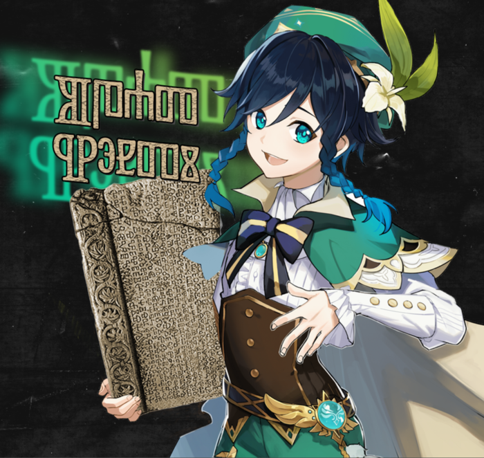

# **Moldify**
## A single python script to make your images look moldy!

| Before Moldify      | After Moldify |
| :----:      | :----:      |
|       |        |
| ./examples/venti.png   | ./examples/venti_mold.jpg       |

## SETUP
  Install Python and install the following dependencies via pip:
  - Pillow
  - numpy
  
There is a **'requrements.txt'** file, so you can just run:

> ` pip install -r requirements.txt `

Once installed, open a terminal and run the script:

> ` python /path/to/script/moldify.py `

There is also a **'moldify-advanced.py'** file which has more user prompts

## HOW IT WORKS
It doesnt take a genius to figure out that this script was poorly written in just about a few hours. But I figured someone might want to make use of it so here you go!

To put it simply, this script has two main *for* loops inside each other.

 The main loop iterates 5 times, takes an image input and applies the following modifications every iteration:
- resizes it by the resolution specified by the user (every loop iteration the resolution is increased by 50 pixels)
- converts the image to `YCbCr` and splits the channels
- applies gaussian blur to the `Cb` and `Cr` channels with the value of `1.85` (In **'moldify-advanced.py'** this it user specified)
- merges the three channels back together and applies sharpness to the image
- saves the image in a jpeg format with low quality and applies slight gaussian blur to the final render

The second loop repeats the above mentioned loop three more times (Iteration is user specified in **'moldify-advanced.py'**) and applies slight color saturation

## ADDITIONAL INFO

When you run the script you will need to specify the file path to where the image is located, including the file extension - `.jpg .png` . You will also need to do this for the file output. I recommend just putting the images in the same folder where the script is located just to make life easier.